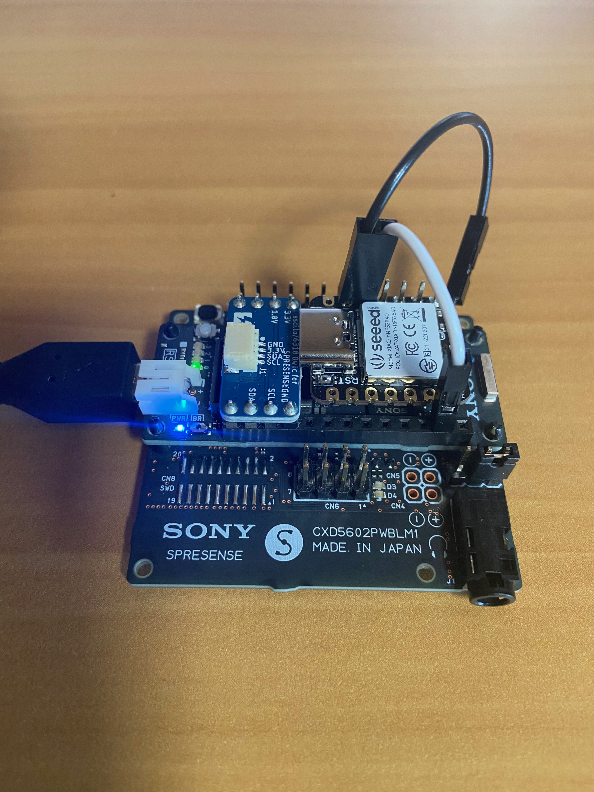
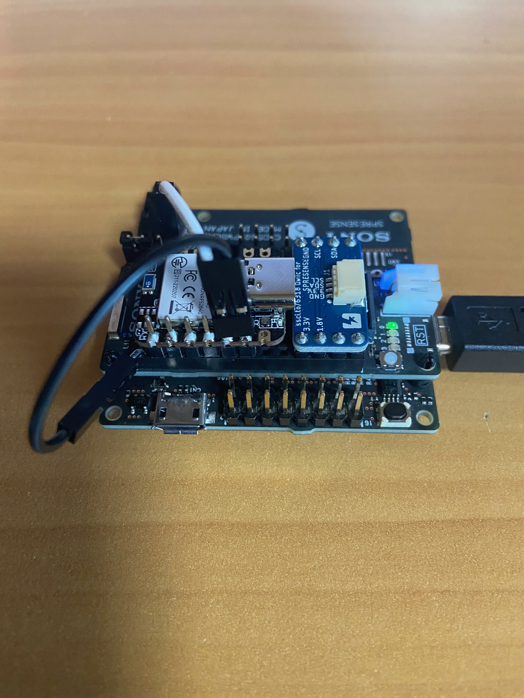
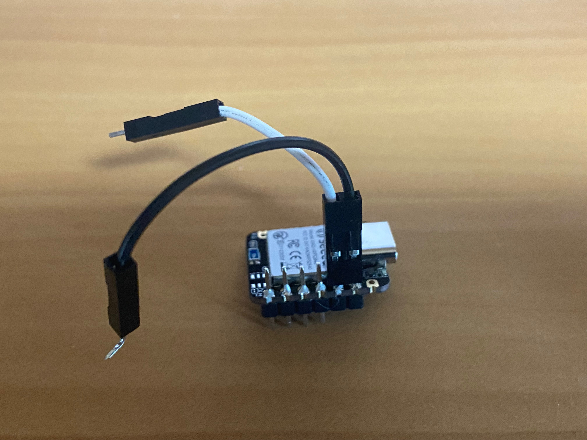
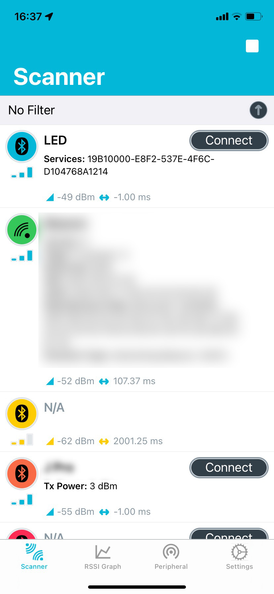
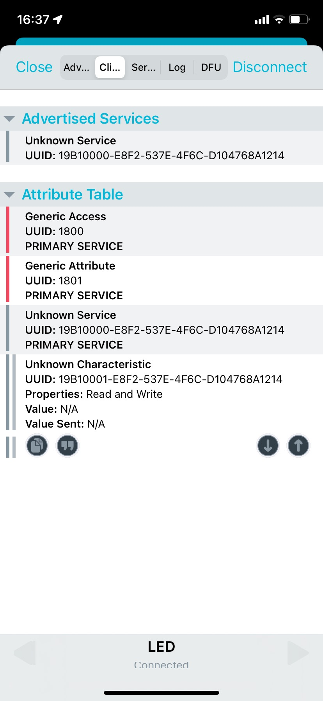
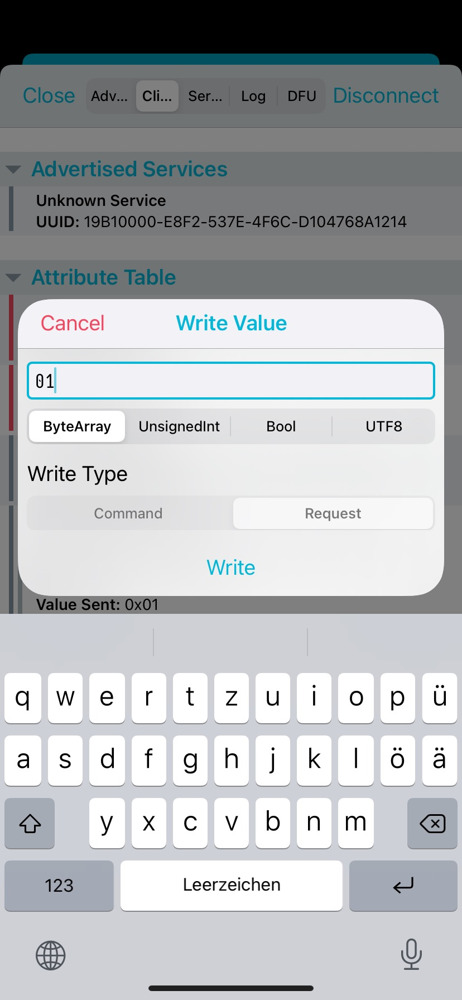

# Enable Bluetooth Low Energy (BLE) on Spresense

## Current State
* I found two add on boards.
	* The official documentation mentions the MK71251-02 by Rohm. [How to equip Spresense with Bluetooth Low Energy (BLE) - Spresense - Sony Developer World](https://developer.sony.com/develop/spresense/tutorials-sample-projects/spresense-tutorials/how-to-equip-spresense-with-bluetooth-low-energy-ble)
		* The manufacturer's website says it is not produced anymore and thus not recommended. See [SPRESENSE Add-on Boards - Wi-SUN & Sensors & Bluetooth® LE  | ローム株式会社 - ROHM Semiconductor](https://www.rohm.co.jp/support/spresense-add-on-board)
		* I could not find documentation. The example uses an AT command to control it and shows only UART over BLE like funtionality. [GitHub - RohmSemiconductor/Arduino: Adruino libraries and samples for Rohm Sensors & Bluetooth LE](https://github.com/RohmSemiconductor/Arduino)
	* [SPRESENSE用 BLEベースボード - SWITCH-SCIENCE](https://www.switch-science.com/catalog/6334/)
		* Provides Nordic UART Service on UART2 of the Spresense Board
* The sample in the Spresense SDK seems to use NuttX Bluetooth library.
	* The only supported hardware is the bcm20706 which is the only HAL implementation.

## Problem Definition
* There is no possibility to use a bluetooth stack and define your own Advertisement or BLE characteristics.
	* Both boards only support UART like communication and not any Bluetooth library like ArduinoBLE.
	* Spresense SDK only supports bcm20706 for which I did not find a breakout board from Adafruit, Sparkfun, Seeedstudio etc.

## Goal & Requirements
* Enable the ArduionoBLE library on the spresense board and make an addon board for Spresene that can use it.
	* Why ArduinoBLE?
		* It seems to be supported best by the Arduino IDE and easy to use
		* The boards supporting ArduinoBLE have a separate MCU for BLE. That means it is a Host - Controller setup on separate MCUs. The communication is using the HCI H4 protocol via UART as specified in the Bluetooth Core Specification Part E Host Controller Interface. That is a well defined standard protocol.
* The addon board must be
	* TELEC certified
	* inexpensive
	* compact
	* be 1.8V compatible to attach it to the Spresense main board

## Plan
* Use a nRF52840 based board as Bluetooth controler with a HCI H4 enabled communication
	* There is an implementation in the Zephyr OS available [Bluetooth: HCI UART — Zephyr Project Documentation](https://docs.zephyrproject.org/2.7.0/samples/bluetooth/hci_uart/README.html)
	* The Seedstudio XIAO BLE satifies all requirements to the board
* Modify the ArduinoBLE libary to make it compatible with this setup.

## Steps

### Compile and flash the Bluetooth HCI UART onto the Seedstudio XIAO BLE
If you just want to try the binary I built (flash.uf2), you do not need this step.
I am using nRF Connect SDK version 1.8.0

#### Add Seedstudio XIAO BLE support to Zephyr by creating board definition files
* The board definiton files need to be copied into zephyr/boards/arm/seeedstudio_xiao_nrf52840
* I took the nrf52840 dongle as a reference and made the following modifications (excluding the renaming parts here)
	* seeedstudio_xiao_nrf52840_defconfig
		* removed the CONFIG_NFCT_PINS_AS_GPIOS=y because it deactivates the NFC pins on the board (not relevant in this case)
	* seeedstudio_xiao_nrf52840.dts
		* removed the button and green led as there is only the RGB LED available for the user
		* defined UART, I2C, SPI and LEDs according to the board's documentation (we will overwrite parts for my needs in the application
		* defined the flash with the image partition starting from 0x27000 as defined on the Adafruit bootloader github page (XIAO BLE seems to use a bootloader derived from this) to stay compatible with the existing bootloader and not to break anything (deleting the softdevice code) when flashing an Arduino sketch afterwards.
	* Kconfig.defconfig
		* Set FLASH_LOAD_OFFSET to 0x27000
	* board.c, board.cmake, CMakeLists.txt
		* Removed these files as I will not use west flash, but uf2 flashing
		* and the startup code setting the voltage is not necessary as XIAO BLE does not seem to use the internal DCDC.
			* nrf_power_mainregstatus_get(NRF_POWER) reports POWER_MAINREGSTATUS_MAINREGSTATUS_Normal,  which means "Normal voltage mode. Voltage supplied on VDD."
#### Configure the Bluetooth HCI UART App
* In the devicetree overlay (boards/seeedstudio_xiao_nrf52840.overlay)
	* set the UART0 pins to match the spresense board, increase speed and add hw-flow-control
	* disable i2c and spi as the pin configuration overlaps
	* (for logging) (not required)
		* activate UART over USB (cdc_acm_uart)
		* choose UART over USB for logging (console, shell) and UART0 for bluetooth related communication
* In the project configuration
	* Set CONFIG_BT_LL_SOFTDEVICE=y to use the Nordic softdevice as Bluetooth link layer
	* The debug overlay would activate the UART over USB, logging and shell
* The only modification I made to the source code in main.c is to light the LED on startup red (glimpse because very short) and enable USB if USB stack is configured (for debugging)

#### Build
* Please refer to the nRF connect SDK documentation on how to setup the environment
* Build for example with
`west build -b seeedstudio_xiao_nrf52840 hci_uart --build-dir build_xiao`

#### Flash
I will use uf2 flash mechanism.
* Convert the resulting hex file to uf2 format (See [GitHub - adafruit/Adafruit_nRF52_Bootloader: USB-enabled bootloaders for the nRF52 BLE SoC chips](https://github.com/adafruit/Adafruit_nRF52_Bootloader#making-your-own-uf2))
`uf2conv.py build_xiao/zephyr/zephyr.hex -c -f 0xADA52840`
* Set the board in bootloader mode by pressing reset twice within 500ms
* Copy the uf2 file onto the board
`cp flash.uf2 /Volumes/XIAO-SENSE/`

### Make the ArduinoBLE library compatible
I was using [GitHub - arduino-libraries/ArduinoBLE: ArduinoBLE library for Arduino](https://github.com/arduino-libraries/ArduinoBLE) version d5bc5b8.
The follwoing changes are required
* src/utility/HCIUartTransport.cpp
	* line 33 exchange `#error "Unsupported board selected!"` with `#define SerialHCI Serial2`
	* line 99 exchange `HCIUartTransportClass HCIUartTransport(SerialHCI, 912600);` with `HCIUartTransportClass HCIUartTransport(SerialHCI, 1000000);`
		* 912600 was not a valid option.
* src/utility/BLEUuid.cpp
	* add an implementation for utoa. I copied the one from here [Adafruit_nRF52_Arduino/itoa.c at master · adafruit/Adafruit_nRF52_Arduino · GitHub](https://github.com/adafruit/Adafruit_nRF52_Arduino/blob/master/cores/nRF5/itoa.c)
* src/utility/GAP.cpp
	* Enable random address flag in the advertisments by
		* line 57 exchange `  if (HCI.leSetAdvertisingParameters(_advertisingInterval, _advertisingInterval, type, 0x00, 0x00, directBdaddr, 0x07, 0) != 0) {` with `  if (HCI.leSetAdvertisingParameters(_advertisingInterval, _advertisingInterval, type, 0x01, 0x00, directBdaddr, 0x07, 0) != 0) {`
### Make the hardware connections

Take care NOT to apply more than 1.8V to the Spresense main board!

The documentation warns for damage when using pins that do not match the Spresense board specs. So take care especially when you bend pins or cut off pins.
"The maximum pin that can be inserted into the socket of each Spresense board is a square pin with a side of 0.64 mm. Inserting a pin with a size larger than this size or a deformed pin into the socket will similarly deform or destroy the contact metal fitting inside the pin socket, resulting in a failure."

The document warns that add on board designs should not be above the GNSS antenna. Else it will not function properly. Should be fine here. I did not test GNSS yet.

Of course you could also attach to the UART2 on the extension board. The LTE extension board does not have UART2

* Connect the pins for UART as specified in the device tree, VCC and GND
	* (XIAO) RX -> (Spresense) TX
	* (XIAO) TX -> (Spresense) RX
	* (XIAO) CTR -> (Spresense) RTS
	* (XIAO) RTS -> (Spresense) CTR
	* (XIAO) 3V3 -> (Spresense) 1.8V
		* 3V3 is actually VCC_OUT. When the XIAO BLE is plugged to USB or BAT is attached, then this pin runs 3.3V
		* Otherwise this pin can be used as a power input. XIAO BLE runs at 1.8V in this case
		* *Therefore NEVER plug in USB or attach a battery to XIA BLE when attached to the Spresense main board!!!*
	* (XIAO) GND -> (Spresense) GND
* Images




## Run a sample sketch (like LED)
 As the XIAO BLE does not have a MAC address burned in, setting a random address is required (thus the modification in GAP.cpp in the library). Set it before calling BLE.advertise().
	* `#include <utility/HCI.h>` ... `static uint8_t randAddr[]= {0xC9, 0xC8, 0x75, 0x00, 0x0A, 0xEF}; HCI.leSetRandomAddress(randAddr);`
* Images of the nRF Connect App connecting and controling the LED




## Open tasks and possible variations

### Variations
* You can use any other board that has BLE and is supported by Zephyr.
* You can modify the pin layout, UART speed or even switch to SPI (You would need to implement a HCITransport for SPI)
* You can use the extension board and run the BLE board with 3.3V

### Open tasks
* By now I was testing the LED sample. I did not yet test other samples or GNSS. Also not BLE signal strength in my setup
* The hardware connections are not optimal ...


## Troubleshooting
* Recovering the original bootloader
	* The original bootloader is not overwritten, however as I do not merge in the Arduino bootloader part. It is required to enter bootloader mode manually by pushing reset twice within 500ms. Then you can use the download button in the Arduino IDE. And it works again for any further downloads as is without pushing the reset button manually
		* The original bootloader can be found here https://github.com/0hotpotman0/BLE_52840_Core/tree/main/bootloader/Seeed_XIAO_nRF52840_Sense
		* The softdevice here https://www.nordicsemi.com/Products/Development-software/S140/Download (Use `uf2conv.py s140_nrf52_7.3.0/s140_nrf52_7.3.0_softdevice.hex -c -f 0xADA52840` and copy the generate uf2 file.)
		* If everything fails, see here https://forum.seeedstudio.com/t/xiao-ble-sense-bootloader-bricked-how-to-restore-it/263091/5 (No need for a Jlink but any SWD programmer will do. e.g. the nRF52840dk)
* When the BLE does not work as expected (I only tested the LED sample sketch so far) (or you want to add new features to the ArduinoBLE library)
	* Add debug prints of the BLE library.
		* Comment in all the `#define _BLE_TRACE_` inside the ArduinoBLE library (Needed to remove some prints as there was a compile error)
		* and call `HCI.debug(Serial2);` (you need to add `#include <utility/HCI.h>`)
	* See the debug prints in the Arduino serial console. Look up "HCI event:" messages. Status codes usually mean there was an error. Definitions are in the Bluetooth Core Specification. Also check "Command tx: ..." messages what is sent to the BLE controller.
		* In the Bluetooth Core Specification
		* Or using Wireshark
			* Create a text file with the hex values which could look like this `0000  01 08 20 20 15 02 01 06 11 06 14 12 8A 76 04 D1 6C 4F 7E 53 F2 E8 00 00 B1 19 00 00 00 00 00 00 00 00 00 00` and in Wireshark File -> Import from Hex dump. Encapsulation Type = Bluetooth H4
			* sample output of above values
```
Bluetooth HCI Command - LE Set Advertising Data
    Command Opcode: LE Set Advertising Data (0x2008)
        0010 00.. .... .... = Opcode Group Field: LE Controller Commands (0x08)
        .... ..00 0000 1000 = Opcode Command Field: LE Set Advertising Data (0x008)
    Parameter Total Length: 32
    Data Length: 21
    Advertising Data
        Flags
            Length: 2
            Type: Flags (0x01)
            000. .... = Reserved: 0x0
            ...0 .... = Simultaneous LE and BR/EDR to Same Device Capable (Host): false (0x0)
            .... 0... = Simultaneous LE and BR/EDR to Same Device Capable (Controller): false (0x0)
            .... .1.. = BR/EDR Not Supported: true (0x1)
            .... ..1. = LE General Discoverable Mode: true (0x1)
            .... ...0 = LE Limited Discoverable Mode: false (0x0)
        128-bit Service Class UUIDs (incomplete)
            Length: 17
            Type: 128-bit Service Class UUIDs (incomplete) (0x06)
            Custom UUID: 19b10000-e8f2-537e-4f6c-d104768a1214 (Unknown)
        Unused
```

## Disclaimer

Although I did not brick or destroy any board and the Arduino bootloader was functional at any time, follow this guide at your own risk. Especial if you made your own adaptions. As the Spresene Main board runs at 1.8V and has short pin headers there is always a risk to make mistakes.